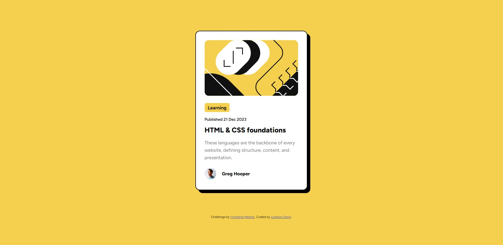

# Frontend Mentor - Blog preview card solution

This is a solution to the [Blog preview card challenge on Frontend Mentor](https://www.frontendmentor.io/challenges/blog-preview-card-ckPaj01IcS). Frontend Mentor challenges help you improve your coding skills by building realistic projects. 

## Table of contents

- [Overview](#overview)
  - [Screenshot](#screenshot)
  - [Links](#links)
  - [Built with](#built-with)
  - [What I learned](#what-i-learned)

### Screenshot

### Links

- Solution URL: [Solution URL](https://github.com/LorenzoSerra1/Blog-Card)
- Live Site URL: [Live Site](https://lorenzoserra1.github.io/Blog-Card/)

## My process

### Built with

- Semantic HTML5 markup
- CSS custom properties
- Flexbox
- Mobile-first workflow

### What I learned

Compared to the first project, here I was able to move better in the code, reconstruct the card more faithfully starting from the design.